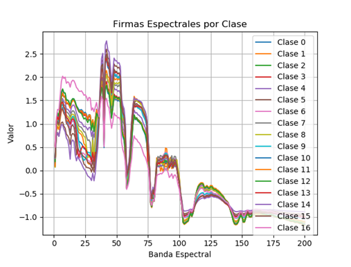

# Sistema no Supervisado para Sensado Remoto Usando HSI
Sensado remoto de vegetación y cultivos usando imágenes hiperespectrales y métodos de entrenamiento tanto supervisados como no supervisados

Este proyecto contiene diferentes aplicaciones con código desarrollado en python.

## Pasos de Instalación para el funcionamiento del Software Desarrollado
1. Descargar e instalar Anaconda.exe
2. conda create -n NOMBRE_DEL_ESPACIO_DE_TRABAJO
3. activate NOMBRE_DEL_ESPACIO_DE_TRABAJO
4. conda install tensorflow-gpu
5. conda install keras
6. conda install matplotlib
7. conda install pylint
8. conda install scikit-learn
9. conda install -c conda-forge scikit-image

### Sincronización con Repositorio en GitHub
Descargar git.exe de https://git-scm.com/ y en la carpeta contenedora del proyecto introducir los siguientes comandos:
1. git clone https://github.com/davidruizhidalgo/unsupervisedRemoteSensing.git
2. git add.
3. git commit -m "Mensaje especificando características de la actualización"
        Si es la primera vez en el repositorio se deben introducir los datos de usuario e email con los comandos 
        sugeridos en la línea de comandos. 
4. git push origin master
### Notas: 
- La programación de los scripts es realizada en python bajo el entorno de desarrollo de visual studio code
- La ruta donde se encuentran los datasets es ../dataSets/, respecto a la carpeta principal unsupervisedRemoteSensing/ 
- Los programas TEST_xxx.py ejecutan los modelos entrenados de las redes y proporcionan las metricas de desempeño:
                OA - Overall Accuracy : número total de items correctamente clasificados sobre el total de elementos.
                AA - Average Accuracy : promedio generado entre los porcentajes de aciertos de cada una de las clases
                k - Kappa Coefficient : El coeficiente Kappa se genera a partir de una prueba estadística para evaluar la precisión de la clasificación. Básicamente, Kappa evalúa qué tan bien se realizó la clasificación en comparación con la asignación de valores aleatorios, es decir, evalúa si la clasificación funcionó mejor que la aleatoria. El coeficiente de Kappa puede variar de -1 t0 1. Un valor de 0 indica que la clasificación no es mejor que una clasificación aleatoria. Un número negativo indica que la clasificación es significativamente peor que aleatoria. Un valor cercano a 1 indica que la clasificación es significativamente mejor que aleatoria.
- se debe respetar la siguiente estructura de archivos: 
### dataSets
   -        DatosSOM       
   -        Indian_pines.mat
   -        Indian_pines_gt.mat
   -        Salinas.mat
   -        Salinas_gt.mat
   -        PaviaU.mat
   -        PaviaU_gt.mat
### unsupervisedRemoteSensing
   -        package/
	- cargarHSI.py
        - dataLogger.py
	- firmasEspectrales.py
	- MorphologicalProfiles.py
	- PCA.py
	- prepararDatos.py
   -	net_1.py
   -	net_2.py
   -	net_n.py
## 1. Package
Paquete que contiene diferentes funciones utilizadas para el procesamiento de las imágenes hiperespectrales:
cargarHSI.py => Permite cargar un archivo .mat con la imagen hiperespectral y el groundtruth. Realiza la normalización de los valores de entrada utilizando la media y la desviación estándar de cada firma espectral. Esto permite obtener datos con media cero y desviación uno. El archivo implementa también funciones de graficar una o dos imágenes de un solo canal.
prepararDatos.py => Permite extraer conjuntos de datos de entrenamiento, validación y prueba en 1D, 2D y 3D, utilizando ventanas y porcentajes de datos variables.
PCA.py => Implementa el análisis de componentes principales sobre la imagen hiperespectral de entrada.
firmasEspectrales.py => Recoge las firmas espectrales de cada una de las clases en la imagen. Calcula el promedio y grafica las firmas espectrales con el objetivo de determinar posibles diferencias en las curvas. 
MorphologicalProfiles.py => Extrae los perfiles morfológicos de cada uno de los canales en una imagen. Implementa Extended Attribute Profiles (EAP) para la generación de características espaciales.
## 2. Análisis de firmas espectrales 
analisisEspectral.py => Permite realizar el análisis de las firmas espectrales de cada una de las clases presentes en la imagen hiperespectral. Se promedia la firma espectral de cada clase y se grafican para observar las diferencias de los espectros.

## 3. Data Logger 
dataLogger.py => Permite almacenar en un archivo .txt los resultados obtenidos con cualquiera de las estructuras desarrolladas. Los datos son almacenados en estructuras matriciales y pueden ser leídos por cualquier sofware de procesamiento como Matplotlib o Matlab. 
## 4. Prueba de Redes Entrenadas
TEST_Networks.py => Carga y ejecución de las redes entrenadas. Genera los coeficientes OA, AA y kappa.  
## 5. Clasificación de una HSI usando EAP y una 2D CNN
hsiCNN2D.py => Entrenamiento de una  red convolucional 2d para clasificación usando HSI. Se utiliza PCA y EAP para reducción dimensional y extracción de características espectrales. A la red convolucional se introduce una ventana sxs de la imagen original para la generación de características espaciales a partir de la convolución. Se utiliza como capa de salida un clasificador tipo Multinomial logistic regression. Todas las capas utilizan entrenamiento supervisado. 
## 6. Clasificación de una HSI usando un Modelo Inseption
hsiINCEPTION.py => Se utiliza la topología de red de grafos INCEPTION para la inclusión de características espectrales y espaciales en la arquitectura de la red profunda. Esto se logra utilizando redes convolucionales con diferentes tamaños de ventana; 1x1 para el manejo de características espectrales y 3x3 o 2x2 para el manejo de posibles dependencias espaciales. Se extrae entonces un tensor 4D utilizando una ventana sxs de la imagen original.
Cada rama de la red INCEPTION tiene el mismo estado de padding='same', lo cual es necesario para mantener todas las salidas de las ramas en el mismo tamaño. Esto posibilita la ejecución de la instrucción concatenate.
Se utiliza como capa de salida un clasificador tipo Multinomial logistic regression. Todas las capas utilizan entrenamiento supervisado. Para el entrenamiento se utiliza el algoritmo de optimización de gradiente descendente estocástico con parámetros variables. 
## 7. Clasificación de una HSI usando 3D CNN
hsiCNN3D.py => Entrenamiento de una  red convolucional 3d para clasificación usando HSI. Se utiliza PCA para reducción dimensional y extracción de características espectrales. A la red convolucional se introduce un tensor 5D de la imagen original para la generación de características a partir de la convolución. Se utiliza como capa de salida un clasificador tipo Multinomial logistic regression. Todas las capas utilizan entrenamiento supervisado. 
## 8. Clasificación de una HSI usando un Modelo Inseption 3D
hsiINCEPTION3D.py => Se utiliza la topología de red de grafos INCEPTION con una modificación para CNN 3D, para la inclusión de características espectrales y espaciales en la arquitectura de la red profunda. Se extrae un tensor 5D utilizando una ventana sxs de la imagen original.
Cada rama de la red INCEPTION tiene el mismo estado de padding='same', lo cual es necesario para mantener todas las salidas de las ramas en el mismo tamaño. Esto posibilita la ejecución de la instrucción concatenate. Se utiliza como capa de salida un clasificador tipo Multinomial logistic regression. Todas las capas utilizan entrenamiento supervisado. Para el entrenamiento se utiliza el algoritmo de optimización de gradiente descendente estocástico con parámetros variables. 
## 9. Clasificación de una HSI usando SOM y CNN
hsiSOMandCNN.py => Entrenamiento de una red convolucional para clasificación usando HSI. Se utiliza selforganized mapas (SOM) para reducción dimensional y extracción de características espectrales.
## 10. Clasificación de una HSI usando SOM y un Modelo Inseption 
hsiSOMandINCEPTION.py => Se utiliza la topología de red de grafos INCEPTION para clasificación usando HSI. Se utiliza self organized mapas (SOM) para reducción dimensional y extracción de características espectrales.

## Esquemas NO Supervisados
