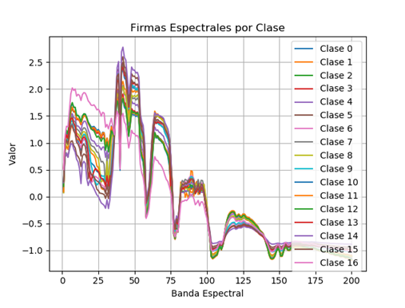
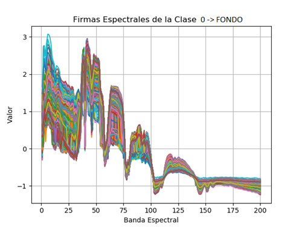
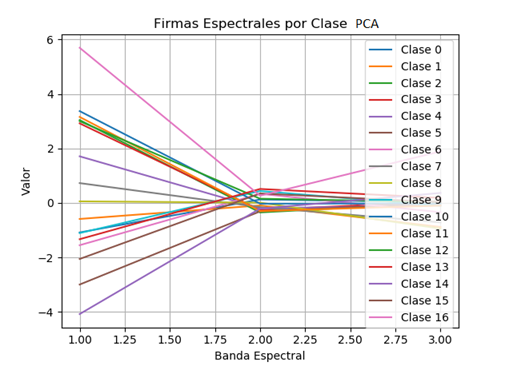
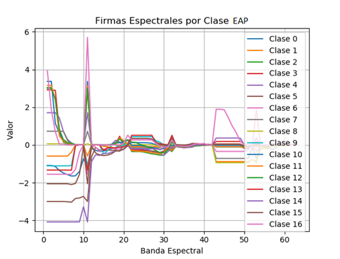
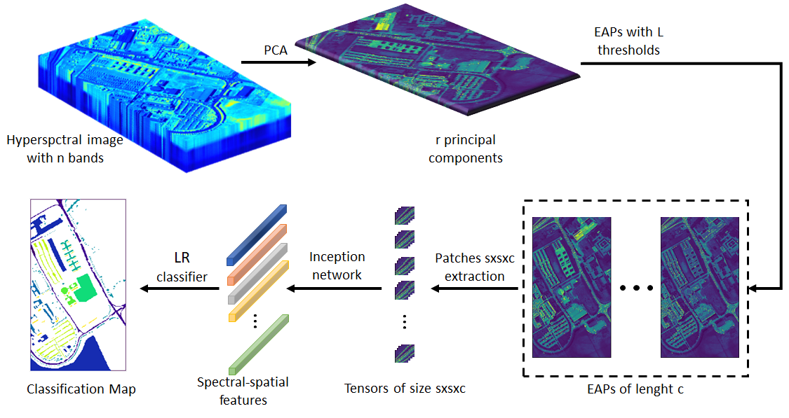
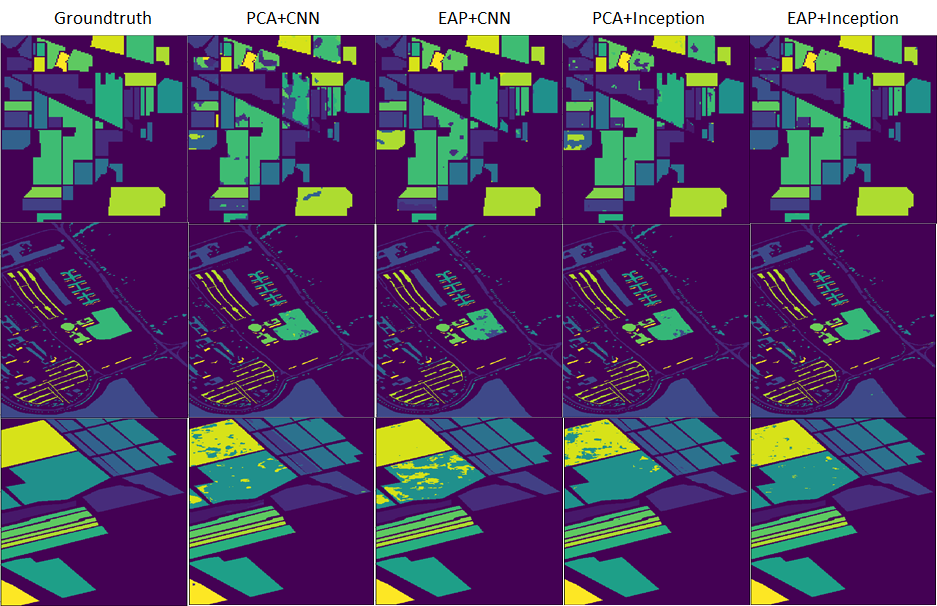
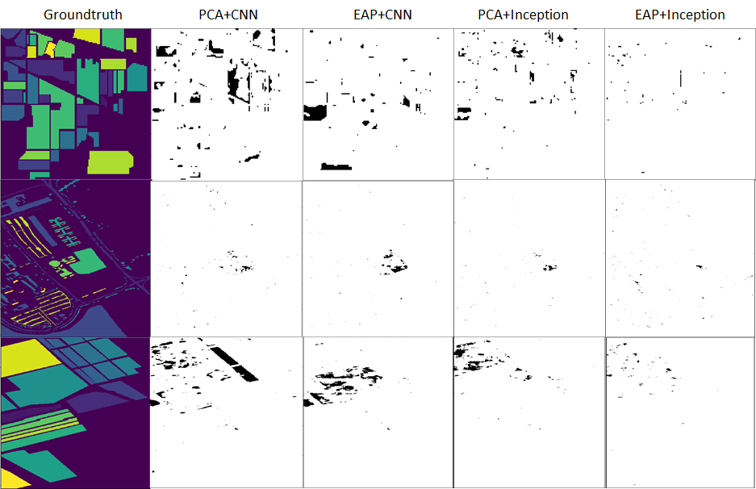
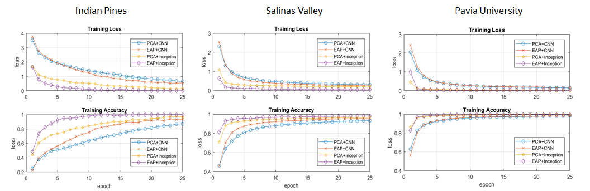

# Sistema no Supervisado para Sensado Remoto Usando HSI
Sensado remoto de vegetación y cultivos usando imágenes hiperespectrales y métodos de entrenamiento tanto supervisados como no supervisados

Este proyecto contiene diferentes aplicaciones con código desarrollado en python.

## Pasos de Instalación para el funcionamiento del Software Desarrollado
1. Descargar e instalar Anaconda.exe
2. conda create -n NOMBRE_DEL_ESPACIO_DE_TRABAJO
3. activate NOMBRE_DEL_ESPACIO_DE_TRABAJO
4. conda install tensorflow-gpu
5. conda install keras
6. conda install matplotlib
7. conda install pylint
8. conda install scikit-learn
9. conda install -c conda-forge scikit-image
10. conda install pydot
11. En el directorio 4_siamxt-master ejecutar: python septup.py install

El toolbox siamxt se descarga desde https://github.com/rmsouza01/siamxt. Para su ejecución es necesario preinstalar Visual Studio Build Tools 2019 
### Sincronización con Repositorio en GitHub
Descargar git.exe de https://git-scm.com/ y en la carpeta contenedora del proyecto introducir los siguientes comandos:
1. git clone https://github.com/davidruizhidalgo/unsupervisedRemoteSensing.git
2. git add.
3. git commit -m "Mensaje especificando características de la actualización"
        Si es la primera vez en el repositorio se deben introducir los datos de usuario e email con los comandos 
        sugeridos en la línea de comandos. 
4. git push origin master
### Notas: 
- La programación de los scripts es realizada en python bajo el entorno de desarrollo de visual studio code
- La ruta donde se encuentran los datasets es ../dataSets/, respecto a la carpeta principal unsupervisedRemoteSensing/ 
- Los programas TEST_xxx.py ejecutan los modelos entrenados de las redes y proporcionan las metricas de desempeño:
                OA - Overall Accuracy : número total de items correctamente clasificados sobre el total de elementos.
                AA - Average Accuracy : promedio generado entre los porcentajes de aciertos de cada una de las clases
                k - Kappa Coefficient : El coeficiente Kappa se genera a partir de una prueba estadística para evaluar la precisión de la clasificación. Básicamente, Kappa evalúa qué tan bien se realizó la clasificación en comparación con la asignación de valores aleatorios, es decir, evalúa si la clasificación funcionó mejor que la aleatoria. El coeficiente de Kappa puede variar de -1 t0 1. Un valor de 0 indica que la clasificación no es mejor que una clasificación aleatoria. Un número negativo indica que la clasificación es significativamente peor que aleatoria. Un valor cercano a 1 indica que la clasificación es significativamente mejor que aleatoria.
- se debe respetar la siguiente estructura de archivos: 
### dataSets/
   - DatosSOM/   
   - Indian_pines.mat
   - Indian_pines_gt.mat
   - Salinas.mat
   - Salinas_gt.mat
   - PaviaU.mat
   - PaviaU_gt.mat
### unsupervisedRemoteSensing/
   - package/
        - cargarHSI.py
        - dataLogger.py
        - firmasEspectrales.py
        - MorphologicalProfiles.py
        - PCA.py
        - prepararDatos.py
   - net_1.py
   - net_2.py
   - net_n.py
La implementación de arquitecturas de redes supervisadas se encuentran en el directorio unsupervisedRemoteSensing/2_Redes Supervisadas. Para ejecutarlas es necesario mover los archivos al directorio principal. 
## 1. Package
La carpeta package contiene diferentes funciones utilizadas para el procesamiento de las imágenes hiperespectrales:
cargarHSI.py => Permite cargar un archivo .mat con la imagen hiperespectral y el groundtruth. Realiza la normalización de los valores de entrada utilizando la media y la desviación estándar de cada firma espectral. Esto permite obtener datos con media cero y desviación uno. El archivo implementa también funciones de graficar una o dos imágenes de un solo canal.
prepararDatos.py => Permite extraer conjuntos de datos de entrenamiento, validación y prueba en 1D, 2D y 3D, utilizando ventanas y porcentajes de datos variables.
PCA.py => Implementa el análisis de componentes principales sobre la imagen hiperespectral de entrada. Se inlcuye la funcion KPCA que implementa kernel principal component analysis utilizando una estrategia de batches para el manejo de imagenes de gran tamaño.
firmasEspectrales.py => Recoge las firmas espectrales de cada una de las clases en la imagen. Calcula el promedio y grafica las firmas espectrales con el objetivo de determinar posibles diferencias en las curvas. 
MorphologicalProfiles.py => Extrae los perfiles de atributos morfológicos de cada uno de los canales en una imagen. Implementa Extended Attribute Profiles (EAP) y Extended Extintion Profiles (EEP) para la generación de características espaciales-espectrales.
dataLogger.py => Permite almacenar en un archivo .txt los resultados obtenidos con cualquiera de las estructuras desarrolladas. Los datos son almacenados en estructuras matriciales y pueden ser leídos por cualquier sofware de procesamiento como Matplotlib o Matlab. 
## 2. Análisis de firmas espectrales 
analisisEspectral.py => Permite realizar el análisis de las firmas espectrales de cada una de las clases presentes en la imagen hiperespectral. Se promedia la firma espectral de cada clase y se grafican para observar las diferencias de los espectros.
En la imagen se presentan las firmas espectrales promedio de cada una de las clases presentes en el dataset Indian Pines. En ella se puede observar la poca variabilidad entre clase que dificulta los procesos de reconocimiento y clasificación en imágenes hiperespectrales. 

Otro factor para tener en cuenta es el ruido generado por el fondo o elementos que no son de interés en la imagen.  La figura presenta las firmas espectrales de los pixeles de fondo en el dataset Indian Pines. La grafica permite observar el altísimo porcentaje de ruido intrínseco a la imagen hiperespectral.  

Por otro lado, las firmas espectrales obtenidas después de un proceso de reducción dimensional con PCA muestran una mejor separabilidad entre las clases, tal como lo indican las gráficas de la imagen. 

Adicionalmente, las firmas espectrales obtenidas después de un proceso de extracción de características utilizando PCA y EAP muestran una mayor variabilidad y por lo tanto favorecen los posteriores procesos de reconocimiento y clasificación. 

## 3. Prueba de Redes Entrenadas
TEST_Networks.py => Carga y ejecución de las redes entrenadas. Genera los coeficientes OA, AA y kappa.  
## 4. Clasificación de una HSI usando EAP y una 2D CNN
hsiCNN2D.py => Entrenamiento de una  red convolucional 2d para clasificación usando HSI. Se utiliza PCA y EAP para reducción dimensional y extracción de características espectrales. A la red convolucional se introduce una ventana sxs de la imagen original para la generación de características espaciales a partir de la convolución. Se utiliza como capa de salida un clasificador tipo softmax. Todas las capas utilizan entrenamiento supervisado. 
## 5. Clasificación de una HSI usando un Modelo Inseption
hsiINCEPTION.py => Se utiliza la topología de red de grafos INCEPTION para la inclusión de características espectrales y espaciales en la arquitectura de la red profunda. Esto se logra utilizando redes convolucionales con diferentes tamaños de ventana; 1x1 para el manejo de características espectrales y 3x3 o 2x2 para el manejo de posibles dependencias espaciales. Se extrae entonces un tensor 4D utilizando una ventana sxs de la imagen original.
Cada rama de la red INCEPTION tiene el mismo estado de padding='same', lo cual es necesario para mantener todas las salidas de las ramas en el mismo tamaño. Esto posibilita la ejecución de la instrucción concatenate.
Se utiliza como capa de salida un clasificador tipo softmax. Todas las capas utilizan entrenamiento supervisado. Para el entrenamiento se utiliza el algoritmo de optimización de gradiente descendente estocástico con parámetros variables. 
En la figura se presenta el diagrama del proceso de reconocmiento y clasificación basado en EAP y una red tipo inception. 

En la figura se presentan los mapas de clasificación obtenidos para los datasets Indian Pines, Pavia University y Salinas Valley, utilizando cada uno de los algoritmos desarrollados al momento.  

En la siguiente grafica se presentan las diferencias encontradas entre los mapas de clasificación obtenidos y el ground thruth de cada uno de los conjuntos de datos analizados.  Los resultados indican que el uso de EAP y la topología de red inception mejoran de forma significativa el desempeño del sistema de clasificación. 

En la siguiente figura se presentan las gráficas de valor de la función de costo y exactitud de la red durante el proceso de entrenamiento.  Los resultados obtenidos corroboran de forma cuantitativa la mejora de desempeño generada por el uso de EAP y la topología de red inception.

## 6. Clasificación de una HSI usando 3D CNN
hsiCNN3D.py => Entrenamiento de una  red convolucional 3d para clasificación usando HSI. Se utiliza PCA para reducción dimensional y extracción de características espectrales. A la red convolucional se introduce un tensor 5D de la imagen original para la generación de características a partir de la convolución. Se utiliza como capa de salida un clasificador tipo softmax. Todas las capas utilizan entrenamiento supervisado. 
## 7. Clasificación de una HSI usando un Modelo Inseption 3D
hsiINCEPTION3D.py => Se utiliza la topología de red de grafos INCEPTION con una modificación para CNN 3D, para la inclusión de características espectrales y espaciales en la arquitectura de la red profunda. Se extrae un tensor 5D utilizando una ventana sxs de la imagen original.
Cada rama de la red INCEPTION tiene el mismo estado de padding='same', lo cual es necesario para mantener todas las salidas de las ramas en el mismo tamaño. Esto posibilita la ejecución de la instrucción concatenate. Se utiliza como capa de salida un clasificador tipo softmax. Todas las capas utilizan entrenamiento supervisado. Para el entrenamiento se utiliza el algoritmo de optimización de gradiente descendente estocástico con parámetros variables. 

Los resultados obtenidos con las topologías de redes en 3D muestran un gran incremento del costo computacional asociado al procesamiento de las imágenes hiperespectrales. El objetivo de la implementación de los modelos en 3D fue poder realizar un procesamiento de los datos en bruto, eliminando elementos de preprocesamiento como PCA y EAP.  Sin embargo, los resultados obtenidos evidencian la necesidad de establecer una etapa de preprocesamiento orientada a la reducción dimensional. En este caso se usa PCA. La ausencia de esta etapa genera un desmejoramiento de los resultados obtenidos por el clasificador.
Cuando se utiliza el proceso de reducción dimensional, los resultados obtenidos son similares a los obtenidos con las redes 2D, por lo cual y al hacer un balance entre la relación costo computacional vs beneficio se concluye que resulta más pertinente la implementación de esquemas de procesamiento convolucional en 2D. 

## 8. Clasificación de una HSI usando SOM y CNN
hsiSOMandCNN.py => Entrenamiento de una red convolucional para clasificación usando HSI. Se utiliza selforganized mapas (SOM) para reducción dimensional y extracción de características espectrales.
## 9. Clasificación de una HSI usando SOM y un Modelo Inseption 
hsiSOMandINCEPTION.py => Se utiliza la topología de red de grafos INCEPTION para clasificación usando HSI. Se utiliza self organized mapas (SOM) para reducción dimensional y extracción de características espectrales.

Anteriormente se había utilizado SOM como elemento de reducción dimensional, el cual acompañado de un clasificador espectral como SVM genero resultados satisfactorios en los procesos de clasificación. Sin embargo, se generaba un mapa de clasificación con alta presencia de ruido sal y pimienta, por lo cual era necesario implementar un bloque de pos-procesamiento que en su momento se basó en operaciones de segmentación morfológicas. 

Al utilizar SOM y redes convolucionales profundas se obtuvo un descenso en los porcentajes de exactitud obtenidos. Se considera que el esquema de reducción dimensional basado en SOM (el cual se realiza de forma unidimensional sobre el eje espectral) no resulta compatible con el esquema de clasificación 2D de las estructuras de las redes convolucionales. En este punto se considera que es necesario actualizar el esquema no supervisado de reducción dimensional basado en SOM, orientándose a un esquema que utilice una topología de red profunda no supervisada como auto-encoders. 

## 10. Clasificación de una HSI usando KPCA y una 2D CNN
kpcaCNN.py => Entrenamiento de una  red convolucional 2d para clasificación usando HSI. Se utiliza KPCA para reducción dimensional y extracción de características espectrales. A la red convolucional se introduce una ventana sxs de la imagen original para la generación de características a partir de la convolución. Se utiliza como capa de salida un clasificador tipo softmax. Todas las capas utilizan entrenamiento supervisado. 
## 11. Clasificación de una HSI usando KPCA y una Red Inseption
kpcaINCEPTION.py => Se utiliza la topología de red de grafos INCEPTION para la inclusión de características espectrales y espaciales en la arquitectura de la red profunda. KPCA es utilizado comom etapa inicial de reducción dimesional. Se utiliza como capa de salida un clasificador tipo softmax. Todas las capas utilizan entrenamiento supervisado. 

## Esquemas NO Supervisados
Los programas ejecutan estructuras de entrenamiento no supervisado para las etapas de extracción de caracteristicas y/o etapa final de clasificación. 
## 12. Stacked Convolutional  Autoencoder (SCAE v1) versión 1
SCAE_v1.py => Se implemeta una estructura de autoencoders convolucionales apilados para la etapa no supervisada de extracción de caracteristicas. PCA y EEP es utilizado como esquema inicial de reducción dimensional y extraccción de caracteristicas. Se implementa el encoder y el decoder convolucional para aprender una representación de las caracteristicas de los datos de entrada. Con el encoder entrenado se implementa una capa de fine tunning supervisada para el ejuste de la ultima capa del clasificador. El proceso utiliza una ventana sxs de la imagen original para la generacion de caracteristicas espaciales a partir de la convolucion. Se utiliza como capa de salida un clasificador tipo Multinomial logistic regression.  
## 13. Stacked Convolutional  Autoencoder (SCAE) y Greedy Layer-Wise Pretraining (GLP) versión 1
SCAE_GLP_v1.py => Greedy Layer-Wise Pretraining se utiliza como esquema de preentrenamiento con el objetvo de mejorar el comportamiento final de la arquitectura. Se implemeta una estructura de autoencoders convolucionales apilados para la etapa no supervisada de extracción de caracteristicas. PCA y EEP es utilizado como esquema inicial de reducción dimensional y extraccción de caracteristicas. Se utiliza como capa de salida un clasificador supervisado tipo Multinomial logistic regression.  
## 14. Branches Convolutional  Autoencoder (BSCAE) versión 1
BCAE_v1.py => Branches Convolutional  Autoencoder implementa el encoder y el decoder convolucional utilizando la arquitectura de la red INCEPTION para aprender una representación de las caracteristicas de los datos de entrada. Con el encoder entrenado se implementa una capa de fine tunning para el ejuste de la ultima capa del clasificador.  El proceso utiliza una ventana sxs de la imagen original para la generacion de caracteristicas espaciales a partir de la convolucion. 
#Se utiliza como capa de salida un clasificador tipo Multinomial logistic regression.  
## 15. Stacked Convolutional  Autoencoder (SCAE) versión 2
SCAE_v1.py => Se implemeta una estructura de autoencoders convolucionales apilados para la etapa no supervisada de extracción de caracteristicas  con capas de reconstrucción tipo refinement_layer. PCA y EEP es utilizado como esquema inicial de reducción dimensional y extraccción de caracteristicas. Se implementa el encoder y el decoder convolucional para aprender una representación de las caracteristicas de los datos de entrada. Con el encoder entrenado se implementa una capa de fine tunning supervisada para el ejuste de la ultima capa del clasificador. 
## 16. Branches Convolutional  Autoencoder (BSCAE) versión 2
En desarrollo........
## 17. Feature Extraction and Classifier
FE_Classifier.py => Carga las redes profundas no supervisadas para extracción de caracteristicas e implementa capas de clasificación para evaluar el desempeño final del sistema. 